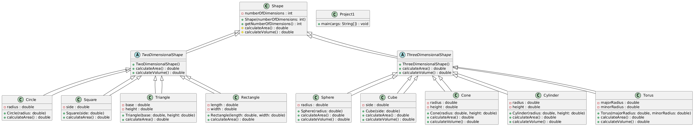
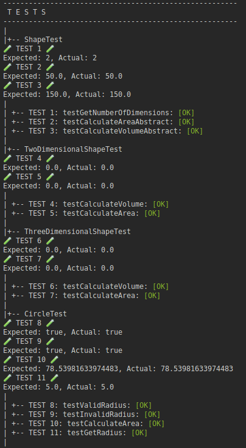
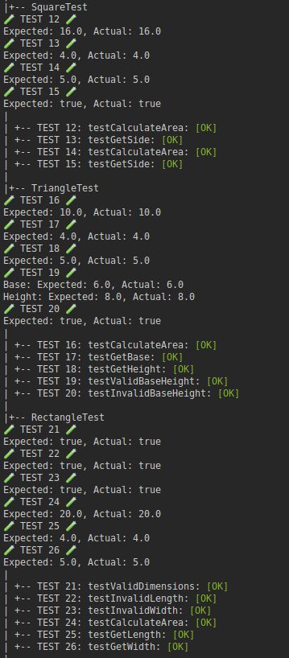
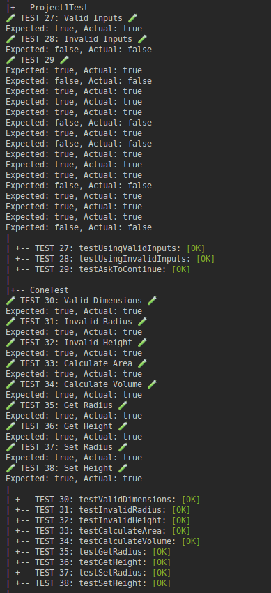
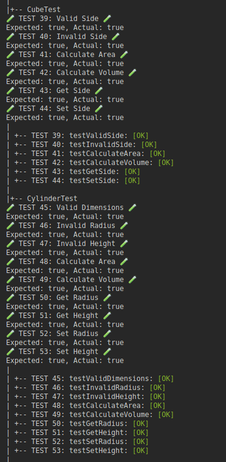
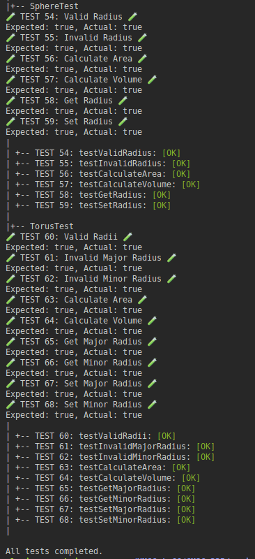

<!-- Title -->
<h1 align="center">Shape Master</h1>
<p align="center">

<i>This project is a Java application that models and manipulates geometric shapes using object-oriented principles like inheritance, polymorphism, and abstraction. It supports two-dimensional and three-dimensional shapes such as circles, squares, triangles, spheres, and cubes, allowing users to calculate areas and volumes while handling invalid inputs gracefully. The application features a command-line interface and a JavaFX-based graphical component for dynamic shape visualization. A comprehensive test suite, executed through a TestRunner utility, ensures the reliability of constructors, methods, and computations, demonstrating robust design, error handling, and testing practices.</i></p>

---

<h2 align="center">Tech Used 🧰</h2>

<!-- Tech Stack -->
<p align="center">
<kbd>
<a href="https://www.java.com/en/">
    
  </a> | <a href="https://makefiletutorial.com/">
    
  </a> | <a href="https://git-scm.com/">
    
  </a>
  
  </kbd>
</p>

## User Guide 📔

This guide provides instructions on how to set up and run the project using two different methods: Cloning the repository and downloading the project as a ZIP file.

### Prerequisites

Before you begin, ensure you have the following installed:

-   Java JDK
-   [JavaJX](https://openjdk.org/) (Note: JavaFX is required to run the project. Download and install it before proceeding. Place the JavaFX .jar files in a `lib` directory at the root of the project.)
-   Git (for cloning the repository)

### File Structure

<details>
<summary><b>See File Tree</b></summary>

The suggested file structure for your project is as follows:

```

.
└── scene_builder_extended/
    ├── bin/
    │   ├── docs/
    │   │   └── json files
    │   ├── main/
    │   │   └── class files
    │   └── test/
    │       └── class files
    ├── lib/
    │   └── javafx.jar files
    ├── public/
    │   ├── cmsc335_project1_test1.png
    │   ├── cmsc335_project1_test2.png
    │   ├── cmsc335_project1_test3.png
    │   ├── cmsc335_project1_test4.png
    │   └── cmsc335_project1_test5.png
    ├── src/
    │   ├── main/
    │   │   ├── Circle.java
    │   │   ├── Cone.java
    │   │   ├── Controller.java
    │   │   ├── Cube.java
    │   │   ├── Cylinder.java
    │   │   ├── DrawableShape.java
    │   │   ├── DrawingPanel.java
    │   │   ├── InvalidEntryException.java
    │   │   ├── main.fxml
    │   │   ├── Project1.java
    │   │   ├── Rectangle.java
    │   │   ├── Scene.java
    │   │   ├── Shape.java
    │   │   ├── Sphere.java
    │   │   ├── Square.java
    │   │   ├── ThreeDimensionalShape.java
    │   │   ├── Torus.java
    │   │   ├── Triangle.java
    │   │   └── TwoDimensionalShape.java
    │   └── test/
    │       ├── CircleTest.java
    │       ├── ConeTest.java
    │       ├── CubeTest.java
    │       ├── CylinderTest.java
    │       ├── GenerateTestFile.java
    │       ├── Project1Test.java
    │       ├── RectangleTest.java
    │       ├── ShapeTest.java
    │       ├── SphereTest.java
    │       ├── SquareTest.java
    │       ├── TestRunner.java
    │       ├── ThreeDimensionalShapeTest.java
    │       ├── TorusTest.java
    │       ├── TriangleTest.java
    │       └── TwoDimensionalShapeTest.java
    ├── .gitignore
    ├── Makefile
    └── README.md

```

</details>

### Option 1️⃣ : Cloning the Repository

1. **Clone the Repository**

    Open your terminal and run the following command to clone the repository: **`git clone git@github.com:sllozier/shape_master.git`**

2. **Navigate to the Project Directory**

    Once the repository is cloned, navigate to the project directory: **`cd path/to/shape_master`**

3. **Using the Makefile**

    - To run tests (this will generate json files), use:**`make run_tests`**

    - To run the project code (this will generate json files), use:**`make run_project`**

    - To clean up and remove generated files, use: **`make clean`**

### Option 2️⃣ : Downloading the ZIP File

1. **Download the Project**

    Go to the repository page on GitHub (or relevant hosting service), and click on the **`Download ZIP`** button. Save the ZIP file to your desired location and extract it.

2. **Navigate to the Project Directory**

    Open your terminal and navigate to the extracted project directory: **`cd path/to/extracted/shape_master`**

3. **Using the Makefile**

    Follow the same steps as in **Option 1** for using the Makefile.

---

_Remember to replace **`[repository URL]`** and **`path/to/shape_master`** with the actual URL of your repository and the path to the **`shape_master`** directory in your local system. This guide assumes that the Makefile is located in the **`shape_master`** directory and is set up as previously discussed._

---

## Approach

The approach to this project began with analyzing the requirements to create an object-oriented Java application for modeling geometric shapes. The design was centered around leveraging inheritance, abstraction, and polymorphism to define a hierarchy of two-dimensional and three-dimensional shapes. Classes like `Shape`, `TwoDimensionalShape`, and `ThreeDimensionalShape` served as the foundation, with specific implementations such as `Circle`, `Square`, `Cube`, and `Torus`. A graphical interface was implemented using JavaFX to visualize shapes dynamically.

Development involved iterative coding and testing, starting with individual shape constructors and methods, ensuring they handled valid and invalid inputs. A custom exception class, `InvalidEntryException`, was introduced for robust error handling. The application underwent rigorous testing using a TestRunner utility, which systematically validated calculations, user inputs, and graphical outputs. By combining methodical design, dynamic visualization, and comprehensive testing, the project achieved a reliable, interactive, and scalable solution.

## Assumptions

I assumed that all shape dimensions provided by the user, such as radius, height, and base, are measured in consistent units. Additionally, I assumed valid JSON structure for the test cases and predefined session data files used during testing. Another assumption was that the JavaFX environment would be correctly set up on the user's machine, as it is essential for running the graphical interface. Finally, I assumed that all required inputs for testing and functionality would be handled within the project's constraints, without external dependencies.

## Lessons Learned

This project was a valuable learning experience in applying object-oriented programming principles, particularly inheritance and polymorphism, to create a modular and scalable design. Working with JavaFX provided insight into building graphical user interfaces and handling user interactions. I also gained a deeper understanding of error handling through custom exceptions, ensuring robust input validation. The testing phase emphasized the importance of comprehensive unit testing to identify edge cases and maintain functionality. Additionally, managing time and prioritizing core requirements underscored the significance of iterative development and focusing on essentials before exploring enhancements. Overall, this project reinforced the value of thoughtful planning, structured coding practices, and continuous testing in software development.

## Possible Improvements

While the project met its primary objectives, several improvements could enhance its functionality and maintainability. Incorporating advanced UI features, such as drag-and-drop shape placement or real-time previews, would improve the user experience. Refactoring some methods to follow cleaner design patterns, could make the codebase more modular and scalable. Time constraints limited the exploration of optimizing performance, particularly in rendering complex shapes or handling large input datasets. Automating test cases for graphical outputs and integrating CI/CD pipelines for testing would also ensure better reliability. Additionally, implementing a database for saving and loading user sessions could provide persistent functionality, enhancing usability. Future iterations could explore these areas for a more polished and robust application.

---

### UML Diagram

<details>
<summary><b>See Diagram</b></summary>



</details>

### Test Plans

<details>
<summary><b>See Table</b></summary>

| Test # | Purpose of Test                                  | Positive/Negative Test | Input Values                         | Expected Result                                | Pass/Fail |
| ------ | ------------------------------------------------ | ---------------------- | ------------------------------------ | ---------------------------------------------- | --------- |
| 1      | Valid dimensions for Circle                      | Positive               | `Radius = 5`                         | `Area = 78.`54                                 | Pass      |
| 2      | Invalid radius for Circle                        | Negative               | `Radius = -5`                        | Exception: "Radius must be greater than 0."    | Pass      |
| 3      | Calculate area of Circle                         | Positive               | `Radius = 3`                         | `Area = 28.27`                                 | Pass      |
| 4      | Get radius of Circle                             | Positive               | `Radius = 4`                         | `Radius = 4`                                   | Pass      |
| 5      | Set valid radius of Circle                       | Positive               | `Radius = 6`                         | `Radius = 6`                                   | Pass      |
| 6      | Set invalid radius of Circle                     | Negative               | `Radius = -3`                        | Exception: "Radius must be greater than 0."    | Pass      |
| 7      | Valid dimensions for Rectangle                   | Positive               | `Length = 4`, `Width = 5`            | `Area = 20`                                    | Pass      |
| 8      | Invalid length for Rectangle                     | Negative               | `Length = -4`, `Width = 5`           | Exception: "Length and width must be > 0."     | Pass      |
| 9      | Invalid width for Rectangle                      | Negative               | `Length = 4`, `Width = -5`           | Exception: "Length and width must be > 0."     | Pass      |
| 10     | Calculate area of Rectangle                      | Positive               | `Length = 4`, `Width = 5`            | `Area = 20`                                    | Pass      |
| 11     | Get length of Rectangle                          | Positive               | `Length = 4`                         | `Length = 4`                                   | Pass      |
| 12     | Get width of Rectangle                           | Positive               | `Width = 5`                          | `Width = 5`                                    | Pass      |
| 13     | Valid side length for Square                     | Positive               | `Side = 4`                           | `Area = 16`                                    | Pass      |
| 14     | Invalid side length for Square                   | Negative               | `Side = -4`                          | Exception: "Side must be greater than 0."      | Pass      |
| 15     | Calculate area of Square                         | Positive               | `Side = 4`                           | `Area = 16`                                    | Pass      |
| 16     | Get side length of Square                        | Positive               | `Side = 4`                           | `Side = 4`                                     | Pass      |
| 17     | Set valid side length of Square                  | Positive               | `Side = 6`                           | `Side = 6`                                     | Pass      |
| 18     | Set invalid side length of Square                | Negative               | `Side = -6`                          | Exception: "Side must be greater than 0."      | Pass      |
| 19     | Valid base and height for Triangle               | Positive               | `Base = 6`, `Height = 4`             | `Area = 12`                                    | Pass      |
| 20     | Invalid base for Triangle                        | Negative               | `Base = -6`, `Height = 4`            | Exception: "Base and Height must be > 0."      | Pass      |
| 21     | Invalid height for Triangle                      | Negative               | `Base = 6`, `Height = -4`            | Exception: "Base and Height must be > 0."      | Pass      |
| 22     | Calculate area of Triangle                       | Positive               | `Base = 6`, `Height = 4`             | `Area = 12`                                    | Pass      |
| 23     | Get base of Triangle                             | Positive               | `Base = 6`                           | `Base = 6`                                     | Pass      |
| 24     | Get height of Triangle                           | Positive               | `Height = 4`                         | `Height = 4`                                   | Pass      |
| 25     | Set valid base of Triangle                       | Positive               | `Base = 8`                           | `Base = 8`                                     | Pass      |
| 26     | Set invalid base of Triangle                     | Negative               | `Base = -8`                          | Exception: "Base must be greater than 0."      | Pass      |
| 27     | Valid dimensions for Cone                        | Positive               | `Radius = 3`, `Height = 5`           | `Volume = 47.12`                               | Pass      |
| 28     | Invalid radius for Cone                          | Negative               | `Radius = -3`, `Height = 5`          | Exception: "Radius and Height must be > 0."    | Pass      |
| 29     | Invalid height for Cone                          | Negative               | `Radius = 3`, `Height = -5`          | Exception: "Radius and Height must be > 0."    | Pass      |
| 30     | Calculate volume of Cone                         | Positive               | `Radius = 3`, `Height = 5`           | `Volume = 47.12`                               | Pass      |
| 31     | Get radius of Cone                               | Positive               | `Radius = 3`                         | `Radius = 3`                                   | Pass      |
| 32     | Set radius of Cone                               | Positive               | `Radius = 4`                         | `Radius = 4`                                   | Pass      |
| 33     | Valid radius for Sphere                          | Positive               | `Radius = 4`                         | `Area = 201.06`                                | Pass      |
| 34     | Invalid radius for Sphere                        | Negative               | `Radius = -4`                        | Exception: "Radius must be greater than 0."    | Pass      |
| 35     | Calculate area of Sphere                         | Positive               | `Radius = 4`                         | `Area = 201.06`                                | Pass      |
| 36     | Calculate volume of Sphere                       | Positive               | `Radius = 4`                         | `Volume = 268.08`                              | Pass      |
| 37     | Get radius of Sphere                             | Positive               | `Radius = 4`                         | `Radius = 4`                                   | Pass      |
| 38     | Set valid radius of Sphere                       | Positive               | `Radius = 6`                         | `Radius = 6`                                   | Pass      |
| 39     | Set invalid radius of Sphere                     | Negative               | `Radius = -6`                        | Exception: "Radius must be greater than 0."    | Pass      |
| 40     | Valid radii for Torus                            | Positive               | `Major = 5`, `Minor = 2`             | `Area = 394.79`                                | Pass      |
| 41     | Invalid major radius for Torus                   | Negative               | `Major = -5`, `Minor = 2`            | Exception: "Major and Minor Radius > 0."       | Pass      |
| 42     | Invalid minor radius for Torus                   | Negative               | `Major = 5`, `Minor = -2`            | Exception: "Major and Minor Radius > 0."       | Pass      |
| 43     | Calculate area of Torus                          | Positive               | `Major = 5`, `Minor = 2`             | `Area = 394.79`                                | Pass      |
| 44     | Calculate volume of Torus                        | Positive               | `Major = 5`, `Minor = 2`             | `Volume = 1570.8`                              | Pass      |
| 45     | Get major radius of Torus                        | Positive               | `Major = 5`                          | `Major = 5`                                    | Pass      |
| 46     | Get minor radius of Torus                        | Positive               | `Minor = 2`                          | `Minor = 2`                                    | Pass      |
| 47     | Set valid major radius of Torus                  | Positive               | `Major = 6`                          | `Major = 6`                                    | Pass      |
| 48     | Set invalid major radius of Torus                | Negative               | `Major = -6`                         | Exception: "Major Radius must be > 0."         | Pass      |
| 49     | Set valid minor radius of Torus                  | Positive               | `Minor = 3`                          | `Minor = 3`                                    | Pass      |
| 50     | Valid sessions in Project1Test                   | Positive               | JSON file inputs                     | All actions completed                          | Pass      |
| 51     | Invalid sessions in Project1Test                 | Negative               | JSON file inputs                     | Exception triggered for invalid actions        | Pass      |
| 52     | askToContinue logic in Project1                  | Positive/Negative      | Inputs: `Y`/`N`                      | Returns true/false depending on input          | Pass      |
| 53     | Valid shape creation for all types               | Positive               | Valid JSON actions                   | Successfully created shapes without exceptions | Pass      |
| 54     | Invalid shape creation for all types             | Negative               | Invalid JSON actions                 | Exceptions triggered for invalid inputs        | Pass      |
| 55     | Validate Sphere constructor with valid radius    | Positive               | `radius = 5`                         | Sphere is created successfully                 | Pass      |
| 56     | Handle invalid radius in Sphere constructor      | Negative               | `radius = -5`                        | Throws `InvalidEntryException`                 | Pass      |
| 57     | Calculate surface area of a Sphere               | Positive               | `radius = 3`                         | `4 * π * r^2 = 113.10`                         | Pass      |
| 58     | Calculate volume of a Sphere                     | Positive               | `radius = 3`                         | `(4/3) * π * r^3 = 113.10`                     | Pass      |
| 59     | Retrieve radius of a Sphere                      | Positive               | Sphere created with `radius = 5`     | Returns `5`                                    | Pass      |
| 60     | Update Sphere radius                             | Positive               | Sphere created, `setRadius(8)`       | Updates radius to `8`                          | Pass      |
| 61     | Validate Torus constructor with valid radii      | Positive               | `majorRadius = 5, minorRadius = 2`   | Torus is created successfully                  | Pass      |
| 62     | Handle invalid major radius in Torus constructor | Negative               | `majorRadius = -5, minorRadius = 2`  | Throws `InvalidEntryException`                 | Pass      |
| 63     | Handle invalid minor radius in Torus constructor | Negative               | `majorRadius = 5, minorRadius = -2`  | Throws `InvalidEntryException`                 | Pass      |
| 64     | Calculate surface area of a Torus                | Positive               | `majorRadius = 5, minorRadius = 2`   | `4 * π^2 * R * r = 789.57`                     | Pass      |
| 65     | Calculate volume of a Torus                      | Positive               | `majorRadius = 5, minorRadius = 2`   | `2 * π^2 * R * r^2 = 789.57`                   | Pass      |
| 66     | Retrieve major radius of a Torus                 | Positive               | Torus created with `majorRadius = 5` | Returns `5`                                    | Pass      |
| 67     | Retrieve minor radius of a Torus                 | Positive               | Torus created with `minorRadius = 2` | Returns `2`                                    | Pass      |
| 68     | Update Torus radii                               | Positive               | Torus created, `setMajorRadius(7)`   | Updates `majorRadius` to `7`                   | Pass      |
|        |                                                  |                        |                                      |                                                |           |

</details>

### Test Runs Screen Shots

<details>
<summary><b>See Image</b></summary>











</details>

---

<h2 align="center">Contact Me 🦄</h2>
<!-- Contact Me -->
<p align="center">
<kbd>
<a href="mailto:sarah.lozier@gmail.com">
    
  </a> | <a href="https://www.sllozier.com">
    
  </a> | <a href="https://www.linkedin.com/in/sarah-l-lozier/">
    
  </a> | <a href="https://github.com/sllozier/resume/raw/main/sarah_lozier_resume%20.pdf">
    
  </a>
  </kbd>
</p>
